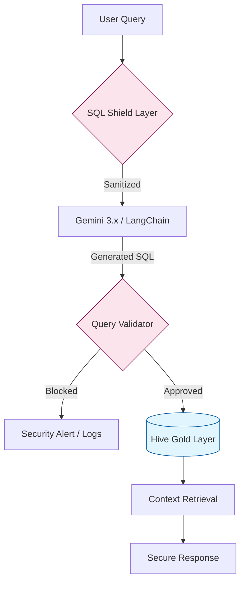

# Secure AI Financial Auditor
### **Enterprise RAG Architecture with SQL-Injection Shielding**

---

## **📌 Executive Overview**
This project implements a **Secure Retrieval-Augmented Generation (RAG)** system designed to provide natural language interfaces for sensitive enterprise financial data. The architecture focuses on solving the "Trust Gap" in GenAI by implementing a multi-layer validation strategy to neutralize **Prompt Injection** and **Unauthorized Data Exfiltration**.

---

## **🏗️ Secure RAG Architecture**
The system is designed with a "Security-First" posture, ensuring the LLM never has direct, un-sanitized access to the database.


## **🛡️ Security & Governance Features**
**SQL-Injection Shield:** A regex-based and structural validator that intercepts LLM-generated SQL strings to block DDL (Data Definition Language) and cross-schema joins.

**Prompt Grounding:** Utilizes a strict "System Instruction" layer and Few-Shot prompting to constrain the LLM's operational boundary to the provided Star Schema.

**PII Masking:** Integrated data-masking logic that redacts sensitive identifiers (IDs, Phone Numbers) before passing retrieved context back to the model.

**Metadata Mapping:** Instead of giving the LLM raw table access, the system uses a semantic metadata layer to map natural language to specific dimensions, significantly reducing hallucinations.

## **⚙️ Engineering Deep Dive**
**The Defensive Validator**
To ensure the LLM remains in "Read-Only" mode, I developed a decorator-based validator that checks for forbidden keywords and ensures the query structure matches the Gold Layer schema.

```Python
def sql_shield(query):
    forbidden = ["DROP", "DELETE", "UPDATE", "INSERT", "TRUNCATE"]
    for word in forbidden:
        if word in query.upper():
            return False, f"Blocked: {word} keyword detected!"
    return True, query
```
.
.
.
.
```
# Check Security
    is_safe, final_query = sql_shield(response)
```
**RAG Chain Implementation**
The orchestration is handled via LangChain, utilizing a custom SQLDatabaseChain modified with a verification step between query generation and execution.

## **🛠️ Technical Stack**
**LLM:** Gemini 3.x (Google AI Studio / Vertex AI)

**Orchestration:** LangChain, Python 3.9+

**Database:** Hive Gold Layer (via PyHive / Thrift)

**Security:** Custom Regex Validators, SQLALchemy


